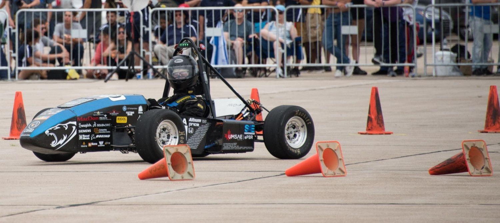

# Welcome to the team 🙌
Here is where the software and electric members store their project repositories

# Software Repositories

- [VCU2.0](https://github.com/UMSAE-Formula-Electric/VCU2.0)  🏎️
- [ACU2.0](https://github.com/UMSAE-Formula-Electric/ACU2.0)  🔋
- [SCU2.0](https://github.com/UMSAE-Formula-Electric/SCU2.0)  🌡️
- [Firmware](https://github.com/UMSAE-Formula-Electric/UMSAE-Firmware)  🏛️

Above is the software repositories that run the epbr race car. This vehical runs on the stm32 ARM-CortexM4 chipset.

## Test Scripts for the Controller Boards
- [VCU_Test_Script](https://github.com/UMSAE-Formula-Electric/VCU_test_script.git) 🏎️📜
- [ACU_Test_Script](https://github.com/UMSAE-Formula-Electric/ACU_test_script.git) 🔋📜
- [SCU_Test_Script](https://github.com/UMSAE-Formula-Electric/SCU_test_script.git) 🌡️📜

Above is the testing repositories for the controller boards. These scripts are used to validate the fucntion of the microcontrollers

<!--

**Here are some ideas to get you started:**

🙋‍♀️ A short introduction - what is your organization all about?
🌈 Contribution guidelines - how can the community get involved?
👩‍💻 Useful resources - where can the community find your docs? Is there anything else the community should know?
🍿 Fun facts - what does your team eat for breakfast?
🧙 Remember, you can do mighty things with the power of [Markdown](https://docs.github.com/github/writing-on-github/getting-started-with-writing-and-formatting-on-github/basic-writing-and-formatting-syntax)
-->
